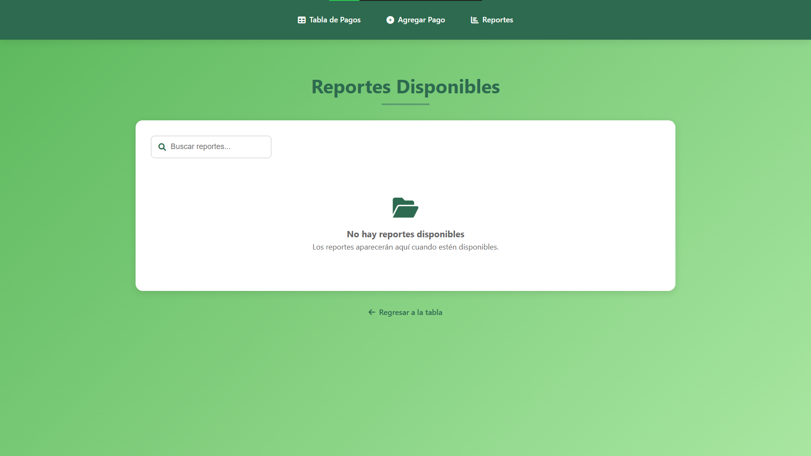
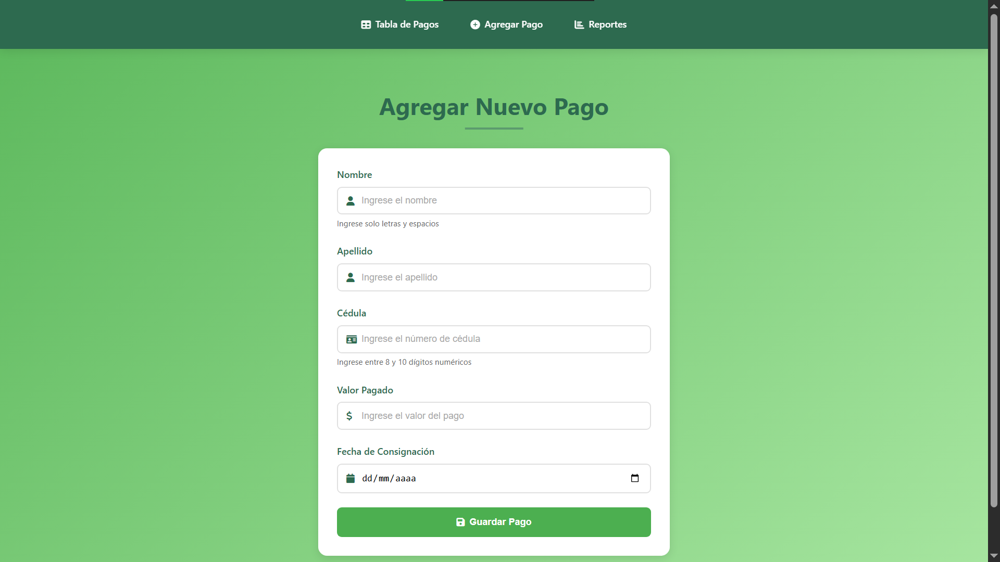
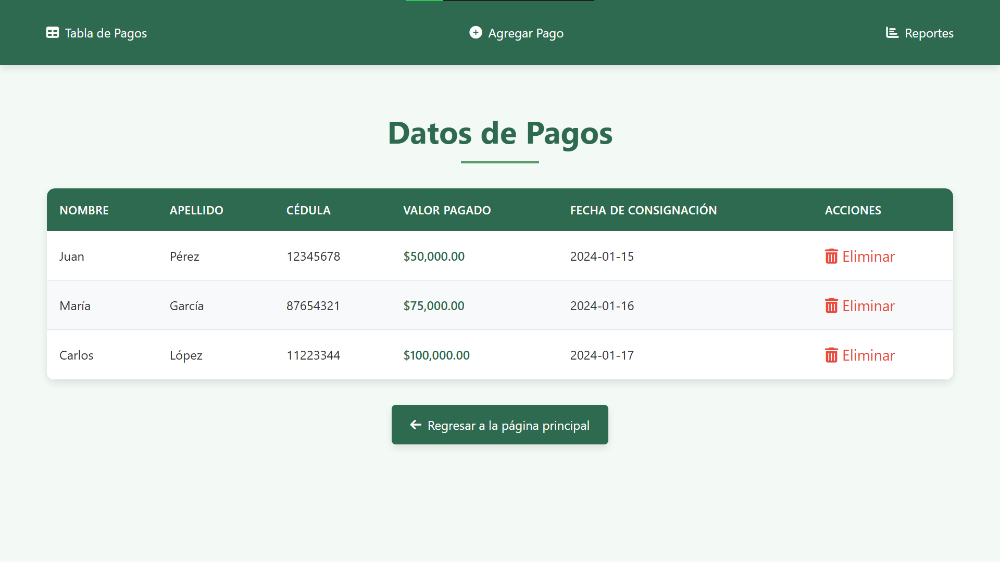

<div align="center">


<br/>


<br/>


<br/><br/>

</div>

---

<div align="center">


<br/>

**A powerful serverless payment management system combining AWS Cloud Services with a modern, interactive web dashboard for real-time payment tracking and automated report generation.**

💰 *Automated • Scalable • Serverless • Real-time* 

</div>

---

## ✨ Key Features

💚 **Fully Automated Reports** — Scheduled daily payment generation at 8:00 AM using EventBridge  
📊 **Real-time Web Dashboard** — Interactive Flask interface for live payment tracking  
⚡ **AWS Lambda Processing** — Serverless PDF report generation with zero infrastructure overhead  
🗄️ **MySQL RDS Storage** — Secure relational database with comprehensive payment records  
☁️ **S3 Cloud Storage** — Automatic report archival with pre-signed secure downloads  
🔄 **Complete CRUD Operations** — Add, view, update, and delete payment transactions  
🔐 **Enterprise Security** — IAM roles, least privilege access, and secure credential management  
📱 **Responsive UI** — Beautiful, modern web interface accessible on all devices  

---

## 🏗️ System Architecture

This project integrates multiple AWS services into a cohesive, serverless payment management ecosystem:

```
AWS Cloud Ecosystem
├── EventBridge (Daily Scheduler - 8:00 AM)
│   └── Lambda Function (PDF Report Generation)
│       └── S3 (Report Archive & Storage)
│
├── RDS MySQL (Payment Database)
│   ├── Payment Records
│   ├── User Information
│   └── Transaction History
│
└── Flask Web Dashboard
    ├── 💳 Payment Records Table
    ├── ➕ Add New Payments
    ├── 🗑️  Delete Transactions
    ├── 📥 Download Reports
    └── 📊 Payment Statistics
```
---
## 📸 Dashboard Preview


- 📷 **Reports Section**  
  

- 📷 **Add Payment Form**  
  

- 📷 **Main Payment Dashboard**  
  

---

## 🛠️ Tech Stack

<div align="center">


</div>

---

## 📋 Project Overview

This project demonstrates enterprise-level serverless architecture combining AWS cloud services with a modern web dashboard. It provides an end-to-end solution for automated payment processing, reporting, and management.

**Core Capabilities:**
- 💚 Automatic daily report generation via AWS Lambda at scheduled times
- 📊 Real-time payment data visualization and management
- ☁️ Cloud-native, zero-infrastructure-management architecture
- 🔄 Complete CRUD (Create, Read, Update, Delete) payment operations
- 💾 Seamless S3 integration for report archival and distribution
- 🔐 Enterprise-grade security with IAM access control

---

## 🔗 AWS Components

### 🗄️ **Amazon RDS - MySQL Database**
Reliable relational database for payment data persistence:
- 👤 **Customer Information** — First name, last name
- 🆔 **Unique Identification** — ID number (Cedula)
- 💰 **Payment Records** — Transaction amounts
- 📅 **Timestamp Data** — Payment dates and times
- 🔍 **Query Capability** — Full SQL support for complex reporting

### ⚡ **AWS Lambda - Serverless Compute**
Autonomous report generation function:
- ⏰ **Scheduled Triggers** — Executes daily at 8:00 AM via EventBridge
- 📊 **Data Query** — Retrieves previous day's payment transactions
- 📄 **PDF Generation** — Creates professional payment summary reports
- 📈 **Statistics** — Calculates totals and transaction counts
- 📤 **S3 Upload** — Automatically distributes reports to S3 bucket
- 🚨 **Error Handling** — Comprehensive logging and failure notifications

### 💾 **Amazon S3 - Object Storage**
Scalable cloud storage for report archival:
- 📚 **Report Storage** — Long-term retention of all generated PDFs
- 🔗 **Easy Retrieval** — Organized folder structure by date
- 🔐 **Security** — Encryption at rest and in transit
- 🌍 **Accessibility** — Pre-signed URLs for secure external access
- 💪 **Durability** — 99.999999999% data durability guarantee

### 🌐 **Flask Web Application**
Modern, responsive user interface:
- 📋 **Payment Dashboard** — Real-time table with all transactions
- ➕ **Add Payments** — Form to insert new payment records
- 🗑️ **Delete Records** — Remove payment entries by ID
- 📥 **Report Downloads** — Access archived reports from S3
- 📱 **Responsive Design** — Optimized for desktop and mobile devices

---

## 🚀 Quick Start

```bash
# 1. Clone the repository
git clone (https://github.com/ANDFS2411x/AWS-S3-LAMBDA-RDS-PAGOS-WEBSITE/)
cd AWS-S3-LAMBDA-RDS-PAGOS-WEBSITE

# 2. Install dependencies
pip install -r requirements.txt

# 3. Configure your AWS credentials
# Set up your AWS_ACCESS_KEY_ID and AWS_SECRET_ACCESS_KEY

# 4. Update database configuration
# Edit DB_CONFIG in app.py with your RDS endpoint

# 5. Run the Flask application
python app.py

# 6. Open browser and navigate to http://localhost:5000
```

---

## 📁 Project Structure

```
AWS-S3-LAMBDA-RDS-PAGOS-WEBSITE/
├── README.md
└── AWS-S3-LAMBDA-RDS-PAGOSWEBSITE/
    ├── app.py                 # Flask application
    ├── templates/
    │   ├── formulario.html    # Payment form
    │   ├── tabla.html         # Payment records table
    │   └── reportes.html      # Reports section
    └── static/                # CSS, JavaScript files
```

---

## 🔧 Configuration

### Environment Variables
```env
DB_HOST=your-rds-endpoint.rds.amazonaws.com
DB_USER=admin
DB_PASSWORD=your-secure-password
DB_NAME=payment_database
S3_BUCKET=your-bucket-name
AWS_REGION=us-east-1
```

### Database Schema
```sql
CREATE TABLE pagos (
    id INT AUTO_INCREMENT PRIMARY KEY,
    Nombre VARCHAR(100) NOT NULL,
    Apellido VARCHAR(100) NOT NULL,
    Cedula VARCHAR(20) UNIQUE NOT NULL,
    Valor_PagosPagado DECIMAL(10, 2) NOT NULL,
    Fecha_Consignacion DATE NOT NULL
);
```

---

## 🎯 Usage Workflow

1. **View Payments** — Navigate to the home page to see all payment records
2. **Add Payment** — Click "Agregar Pago" to add a new payment record
3. **Download Reports** — Access pre-generated reports from the Reports section
4. **Automated Reports** — Lambda automatically generates reports daily at 8:00 AM
5. **Archive** — Reports are automatically saved to S3 for long-term storage

---

<div align="center">


## 👨‍💻 Author

**Andrés Fábregas**  
Software Developer & Cloud Architect

---

<div align="center">

⭐ If you found this project helpful, please consider giving it a star! ⭐

</div>
